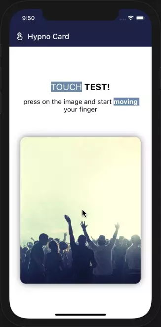

# Hypno Card

Simple widget to play around with gestures and perspective using [**Transform**](https://api.flutter.dev/flutter/widgets/Transform-class.html).

## Properties

* **_Null safety_** `height`: The height of the widget. If null, it expands with it's `child`.
* **_Null safety_** `padding`: Extra padding outside it's `child`.
* **_Null safety_** `color`: Background color for the entire widget.
* **_Null safety_** `borderRadius`: [**BorderRadius**](https://api.flutter.dev/flutter/painting/BorderRadius-class.html) for the entire widget.
* **_Null safety_** `decorationImage`: [**DecorationImage**](https://api.flutter.dev/flutter/painting/DecorationImage/DecorationImage.html) for the entire widget.
* **_Null safety_** `blurRadiusShadow`: `blurRadius` for shadow outside the widget. Default value is 15.
* **_Null safety_** `colorShadow`: color used for shadow. Default value is `Theme.of(context).primaryColor.withOpacity(.5)`
* **_Null safety_** `force`: Intesity of movement the widget and shadow will take when touching. Default value is 1.
* **_Null safety_** `onTap`: functio the widget will take on a single tap.
* **_Null safety_** `child`: The widget below this widget in the tree.

